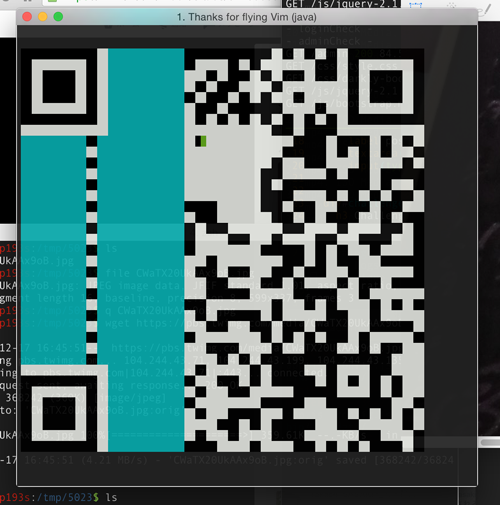

# CQR
QR code editor



## Installation
```sh
git clone https://github.com/193s/CQR
cd CQR
sbt assembly
sudo install ./cqr /usr/local/bin
```

## Usage
type `./cqr --help`

```
./cqr --help
CQR 1.0
Usage: cqr [options]

  -i <file> | --in <file>
        input file
  -o <file> | --out <file>
        output file
  -v <value> | --version <value>
        specify version (new QR with properly size will be generated)
  --help
        display this message
```

### Key bindings
`x` or ` `: fill  
`h`: move left  
`j`: move down  
`k`: move up  
`l`: move right  
`q`: save & exit  

